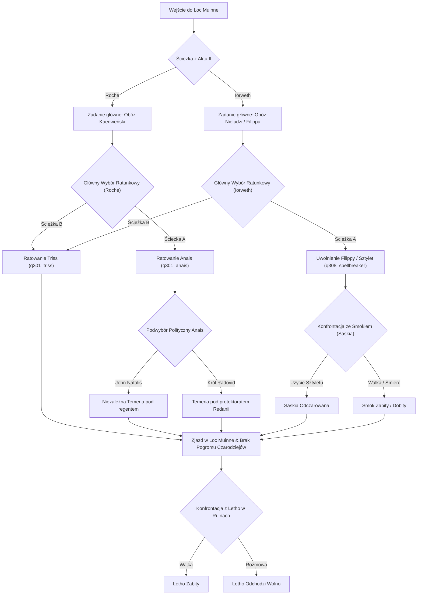

# Struktura Fabuły, Questów i Bazy Faktów (FactsDB) Gry Wiedźmin 2

Dokument zawiera wyczerpujące zestawienie oryginalnej osi fabularnej gry *Wiedźmin 2: Zabójcy Królów*, słownik kluczowych flag logicznych (`FactsDB`) oraz szczegółową analizę drzewa questów i wyborów ze szczególnym uwzględnieniem Aktu III (Loc Muinne).

---

## 🔑 1. Słownik Głównych Faktów Logicznych (FactsDB Reference Table)

Baza `FactsDB` w silniku REDengine odpowiada za śledzenie stanu świata, stanów ukończenia zadań oraz decyzji podjętych przez gracza.

| Nazwa Faktu (`Fact ID`) | Ustawiany w momencie... | Wpływ na rozgrywkę / Questy |
| :--- | :--- | :--- |
| **`q108_helping_roche`** | Wyboru pomocy Vernonowi Roche'owi w Akcie I (`q108_choice`) | Aktywuje ścieżkę Roche'a, obóz Kaedweński w Akcie II |
| **`q108_helping_scoia`** | Wyboru pomocy Iorwethowi w Akcie I (`q108_choice`) | Aktywuje ścieżkę Iorwetha, Wolne Miasto Vergen w Akcie II |
| **`side_chosen`** | Zakończenia Aktu I po walce w ruinach / porwaniu barge | Oznacza trwale wybraną stronę konfliktu |
| **`q201_roche_path`** | Wejścia do Aktu II ze ścieżki Roche'a | Aktywuje logikę Obozu Kaedweńskiego |
| **`q201_iorveth_path`** | Wejścia do Aktu II ze ścieżki Iorwetha | Aktywuje logikę Vergen |
| **`q208_mist_cleared`** | Odczarowania Mgły Wojny w Akcie II | Otwiera drogę do bitwy o Vergen |
| **`q301_saved_triss`** | Uratowania Triss z obozu Nilfgaardczyków w Akcie III | Zmienia przebieg zjazdu w Loc Muinne i brak pogromu czarodziejów |
| **`q301_saved_anais`** | Uratowania Anais La Valette z obozu Kaedweńczyków | Zmienia sytuację polityczną Temerii |
| **`q308_saved_philippa`** | Uwolnienia Filippy Eilhart z więzienia w Akcie III | Umożliwia zdobycie sztyletu do odczarowania Saskii |
| **`q308_saskia_unspelled`** | Użycia sztyletu na Saskii w formie smoka | Zdejmuje urok z Saskii i uniezależnia ją |

---

## 🏛️ 2. Szczegółowa Mapa Wyborów i Podwyborów w Akcie III (Loc Muinne)

Akt III stanowi **poligon doświadczalny i rozgrzewkę moderską (Etap 1)** dla modyfikacji hybrydowej.

### Podsumowanie Wyborów w Akcie III:
1. **Główny Split Ratunkowy:**
   * W oryginalnej grze ratowanie Triss wyklucza ratowanie Anais (ścieżka Roche'a) lub Filippy (ścieżka Iorwetha) poprzez sygnał `QuestFailed`.
   * **Cel Moda w Akcie III:** Przepięcie węzłów tak, aby Geralt mógł wykonać **zarówno ratunek Triss, jak i zadanie frakcyjne**.
2. **Konsekwencje Polityczne Anais:**
   * Przekazanie Anais Natalisowi zachowuje suwerenność Temerii.
   * Przekazanie Anais Radovidowi wciela Temerię do Redanii (godło Redanii na fladze).
3. **Odczarowanie Saskii (Łamacz Czarów):**
   * Uwolnienie Filippy pozwala zdobyć sztylet. Po walce ze smokiem na dachu wieży pojawia się opcja dialogowa użycia sztyletu i zdjęcia uroku z Saskii.
4. **Finał z Letho:**
   * Po wypiciu wódki w ruinach Geralt decyduje, czy walczyć z Letho, czy pozwolić mu odejść na Południe.

---

## 📜 3. Tabelaryczne Drzewo Questów Oryginalnej Gry

### A. Akt I – Flotsam i Rozdroże

| Nazwa Zadania | Plik Grafu (.w2quest / .w2phase) | Kluczowe Fakty FactsDB | Wyzwalacze QuestFailed | Status w Modzie |
| :--- | :--- | :--- | :--- | :--- |
| **Na rozdrożu: Roche** | `q108_choice.w2phase` | `q108_helping_roche` | Wybór akcji u Iorwetha | **[ZMODYFIKOWANE]** Zduplikowane wyjście |
| **Na rozdrożu: Iorweth** | `q108_choice.w2phase` | `q108_helping_scoia` | Wybór akcji u Roche'a | **[ZMODYFIKOWANE]** Zduplikowane wyjście |
| **Róża Pamięci** | `q105_rose.w2phase` | `q105_has_rose` | Brak | Oryginał |
| **Zabójcy Królów (Barka)** | `q107_barge.w2phase` | `q107_barge_done` | Wybór drugiej strony | **[DO EDYCJI]** |

### B. Akt II – Obóz Kaedwen (Ścieżka Roche'a)

| Nazwa Zadania | Plik Grafu (.w2quest / .w2phase) | Kluczowe Fakty FactsDB | Wyzwalacze QuestFailed | Status w Modzie |
| :--- | :--- | :--- | :--- | :--- |
| **Teoria Spisku / Monety** | `q210r_conspiracy.w2phase` | `q210r_square_coin` | Wejście na ścieżkę Iorwetha | **[DO EDYCJI]** Wyselekcjonowane |
| **Klątwa Króla Henselta** | `q211r_curse.w2phase` | `q211r_sabrina_curse_lifted` | Wybór Vergen | **[DO EDYCJI]** Wyselekcjonowane |
| **Kawiak / Obóz Kaedwen** | `act2_community_camp_spawn.w2phase` | `factions_attitude_kaedwen` | Agresja strażników | **[DO EDYCJI]** Frakcje |

### C. Akt II – Wolne Miasto Vergen (Ścieżka Iorwetha)

| Nazwa Zadania | Plik Grafu (.w2quest / .w2phase) | Kluczowe Fakty FactsDB | Wyzwalacze QuestFailed | Status w Modzie |
| :--- | :--- | :--- | :--- | :--- |
| **Kwestia Życia i Śmierci (Saskia)**| `q202_poisoning.w2phase` | `q202_saskia_cured` | Wejście do Kaedwen | **[DO EDYCJI]** Wyselekcjonowane |
| **Krew Królewska (Stennis)** | `q205_stennis.w2phase` | `q205_stennis_dead` / `alive` | Brak | **[DO EDYCJI]** |
| **Spalone Miasteczko (SQ202)** | `sq202_burned_village.w2phase` | `sq202_done` | Brak | **[ZMODYFIKOWANE]** Zsynchronizowane |

### D. Akt III – Loc Muinne (Prototyp Etapu 1)

| Nazwa Zadania | Plik Grafu (.w2quest / .w2phase) | Kluczowe Fakty FactsDB | Wyzwalacze QuestFailed | Status w Modzie |
| :--- | :--- | :--- | :--- | :--- |
| **Gdzie jest Triss Merigold?** | `q301_triss_rescue.w2phase` | `q301_saved_triss` | Wybór Anais/Filippy | **[W TRAKCIE]** PoC Odblokowany |
| **Łamacz Czarów (Filippa)** | `q308_spellbreaker.w2phase` | `q308_saved_philippa` | Ratowanie Triss | **[W TRAKCIE]** PoC Odblokowany |
| **Za Temerię! (Anais)** | `q301_roche_anais.w2phase` | `q301_saved_anais` | Ratowanie Triss | **[DO TESTÓW]** |
